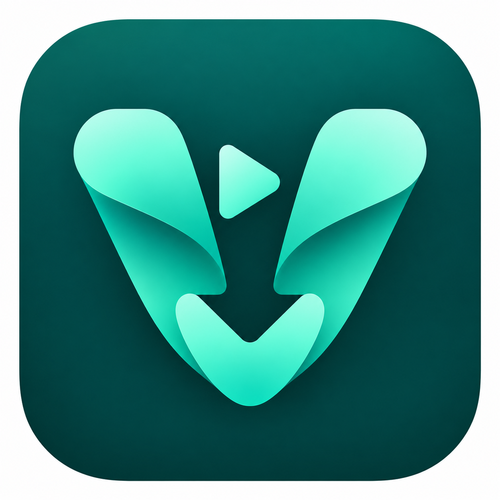

# Vidora — ویدورا



A local-first desktop video downloader built with Flutter, yt-dlp, FFmpeg and Deno. The interface supports **Persian, Arabic, English and Chinese**, including RTL layouts for Persian and Arabic.

[راهنمای فارسی](README.fa.md) · [Build and packaging](docs/BUILD.md) · [Cookies](docs/COOKIES.fa.md) · [Support](docs/SUPPORT.md)

## What works

- Paste a link to inspect its title, thumbnail and available video formats.
- Choose quality and container; see known or estimated download sizes including separate audio.
- Choose a destination, queue downloads, view progress/speed, cancel or retry, and open the output folder.
- Use system, direct or explicit HTTP/SOCKS proxy settings.
- Optionally select a local Netscape cookies.txt file for the target site.
- Download and merge audio/video entirely on your device.

There is **no Vidora backend, cloud storage or app account**. The app contacts the source video/thumbnail sites. An optional donation page opens only when requested; no video URL, cookie jar or downloaded file is passed to it.

## Status

Version **0.1.6**. Windows x64 release builds and automated tests have been run locally. macOS and Linux source runners and packaging scripts are included, but their native release builds have not been tested on this Windows machine. Android is not implemented yet; `DownloadEngine` provides the engine boundary for a future mobile adapter.

Site support is best effort. Login restrictions, anti-bot checks, DRM, geography, expired links and site changes may prevent a download. Successful YouTube downloads reported by the project owner do not guarantee every YouTube link will work.

## Run from this checkout

Requires Flutter (tested with **3.41.2 / Dart 3.11**), a desktop build toolchain and the four local engine binaries. End users of a complete installer do not install Python, FFmpeg or Deno themselves.

```powershell
flutter pub get
$env:LOCAL_VIDEO_TOOLS = (Resolve-Path runtime/windows).Path
flutter run -d windows
```

Runtime binaries are present in the developer's local checkout but are **excluded from Git**. A fresh clone must stage them using [the build guide](docs/BUILD.md). Never commit browser cookies or account secrets.

```sh
flutter analyze
flutter test
```

The external-network smoke test is opt-in. Optional local engine integration tests require environment variables described in the build guide.

## Project layout

```text
lib/          Flutter UI, translations, safe local process engine, cookies and support
assets/       Fonts, logo and public donation configuration
windows/      Windows runner
macos/        macOS runner and entitlements
linux/        Linux runner
runtime/      Local engines, recorded hashes and dependency notices
scripts/      Runtime preparation and native packaging
test/         Engine, privacy, localization and support tests
docs/         Build, cookie, support and release documentation
dist/         Local installers/portable builds (not committed)
```

## Support development

Vidora is free; support is optional. The app and `assets/support.json` contain separate public receiving details:

| Currency | Network | Address |
| --- | --- | --- |
| USDT | BSC / BEP20 | `0x9a350193884756c2ff75e58847d8eff5441c27bf` |
| TRX | TRON — TRX only | `TBiSUJuPZfLAJ9VHiQuGpNVPzsEYixgp13` |

Use only the currency/network shown for that row. These are owner-provided exchange deposit addresses. Actual receipt, ownership, address lifetime, minimum deposit and exchange availability have not been verified by the developer. See [support details](docs/SUPPORT.md). This app does not connect a wallet, create transactions or verify payments.

## License and distribution

Vidora's own source uses the existing [MIT license](LICENSE). Dependencies retain their own licenses; MIT does not relicense yt-dlp's bundled libraries, FFmpeg, Deno, Flutter or the fonts. See [third-party notices](THIRD_PARTY_NOTICES.md).

The locally staged FFmpeg build is GPLv3. **Before public distribution of installers containing that build, provide its complete corresponding source, including linked libraries and build information, as required by its license.** Current source pointers/build notices do not complete that release requirement. Release packages have not been published to GitHub by this task.
