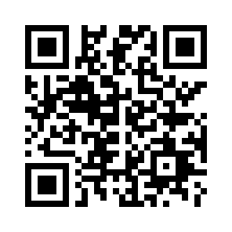
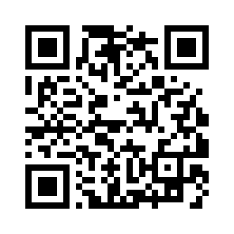

# Support Vidora

[English](#english) · [فارسی](#فارسی) · [العربية](#العربية) · [中文](#中文)


## English

Vidora is developed by **Zolfaghari**. If you find it useful, consider supporting continued development, bug fixes and updates. Support is optional and all features remain free.

Copy an address below or scan its QR code. **QR codes contain the address only; they do not select a currency or network.** Check the currency, network and address in your wallet before confirming.

### USDT — BSC / BEP20 only

```text
0x9a350193884756c2ff75e58847d8eff5441c27bf
```



### TRX — TRON only

```text
TBiSUJuPZfLAJ9VHiQuGpNVPzsEYixgp13
```



Use only the currency and network listed for each address. Do not send USDT to the TRX address or use Ethereum or TRON for the USDT address. These are exchange deposit addresses. Before sending, ask about deposit availability, minimum amounts and supported transfer methods. You can [open an issue](https://github.com/mohammadhosseinz/Vidora/issues/new) to ask about these public details.

Payments are made through your own wallet or exchange, outside GitHub Sponsors. This page does not connect a wallet or process payments. Thank you for supporting Vidora.

## فارسی

ویدورا توسط **ذوالفقاری** توسعه داده می‌شود. اگر برنامه برایتان مفید بوده، می‌توانید از ادامهٔ توسعه، رفع اشکال‌ها و انتشار به‌روزرسانی‌ها حمایت کنید. حمایت کاملاً اختیاری است و همهٔ امکانات رایگان می‌مانند.

آدرس‌ها و QRها در بالای صفحه آمده‌اند: **USDT فقط روی BSC / BEP20** و **TRX فقط روی TRON**. QR فقط آدرس را دارد؛ ارز یا شبکه را انتخاب نمی‌کند. پیش از تأیید، ارز، شبکه و آدرس را بررسی کنید. به آدرس TRX تتر نفرستید و برای آدرس USDT از Ethereum یا TRON استفاده نکنید.

این آدرس‌ها برای واریز به صرافی هستند. پیش از ارسال، دربارهٔ فعال‌بودن واریز، حداقل مبلغ و روش انتقال مجاز سؤال کنید. برای پرسیدن این اطلاعات عمومی می‌توانید [Issue باز کنید](https://github.com/mohammadhosseinz/Vidora/issues/new).

پرداخت از کیف پول یا صرافی خودتان و خارج از GitHub Sponsors انجام می‌شود. این صفحه کیف پول را متصل نمی‌کند و پرداختی انجام نمی‌دهد. از حمایت شما سپاسگزاریم.

## العربية

يطوّر **Zolfaghari** تطبيق Vidora. إذا أفادك، يمكنك دعم تطويره وإصلاح الأخطاء وإصدار التحديثات. الدعم اختياري وجميع الميزات مجانية.

العناوين ورموز QR أعلاه مخصصة لـ **USDT على BSC / BEP20 فقط** و**TRX على TRON فقط**. يحتوي QR على العنوان فقط؛ اختر العملة والشبكة الصحيحتين بنفسك. لا ترسل USDT إلى عنوان TRX ولا تستخدم Ethereum أو TRON لعنوان USDT.

هذه عناوين إيداع لدى منصة تداول. اسأل عن توفر الإيداع والحد الأدنى وطرق التحويل المقبولة قبل الإرسال. يمكنك [فتح Issue](https://github.com/mohammadhosseinz/Vidora/issues/new) للاستفسار عن هذه المعلومات العامة. يجري الدفع من محفظتك أو منصتك خارج GitHub Sponsors؛ هذه الصفحة لا تربط محفظة ولا تعالج المدفوعات. شكراً لدعمك.

## 中文

Vidora 由 **Zolfaghari** 开发。如果应用对您有帮助，欢迎支持后续开发、问题修复和更新。支持完全自愿，所有功能仍然免费。

上方地址和二维码分别用于 **BSC / BEP20 上的 USDT** 和 **TRON 上的 TRX**。二维码仅包含地址，不会选择币种或网络。请在确认前检查币种、网络和地址。请勿向 TRX 地址发送 USDT，也不要通过 Ethereum 或 TRON 向 USDT 地址转账。

这些地址是交易所充值地址。发送前，请确认充值是否开放、最低金额和允许的转账方式。您可以[提交 Issue](https://github.com/mohammadhosseinz/Vidora/issues/new)询问这些公开信息。付款通过您自己的钱包或交易所完成，不经过 GitHub Sponsors。本页面不会连接钱包或处理付款。感谢您的支持。
